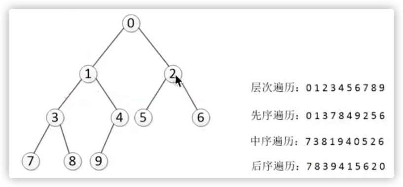

## 二叉树

### 相关概念
1. 二叉树: 每个节点都有两个节点的树, 每个节点至多拥有两颗子树(即二叉树中不存在度大于2的节点),并且二叉树的子树有左右之分,次序不能随意颠倒

二叉树分为: 满二叉树, 完全二叉树, 完满二叉树

1. 二叉查找树: 也成为有序二叉查找树, 满足二叉树的一般性质  性质如下:
   1. 任意节点左子树不为空, 且左子树的值均小于根节点的值
   2. 任意节点右子树不为空, 且右子树的值均大于根节点的值
   3. 任意节点的左右子树也分别是二叉查找树
   4. 没有键值相等的节点 
2. 满二叉树: 除叶子节点之外的每一个节点都有两个孩子节点, 每层都完全被填充
3. 完全二叉树: 除最后一层之外的所有节点都被填充, 并且所有节点都向左对齐 
4. 完满二叉树: 除叶子节点之外的每一个节点都有两个孩子节点 (对比满二叉树, 每一层不一定被填满)
5. 平衡二叉树: 任意一个节点的左右两个子树 高度差<=1
6. 红黑树:  自平衡的二叉查找树

### 树的遍历 
1. 广度优先遍历:  底层实现是队列   遍历顺序是 一层一层 从左到右
2. 深度遍历:  分为 
   1. 先序:  根 -> 左 -> 右
   2. 中序:  左 -> 中 -> 右
   3. 后续:  左 -> 右 -> 根
   